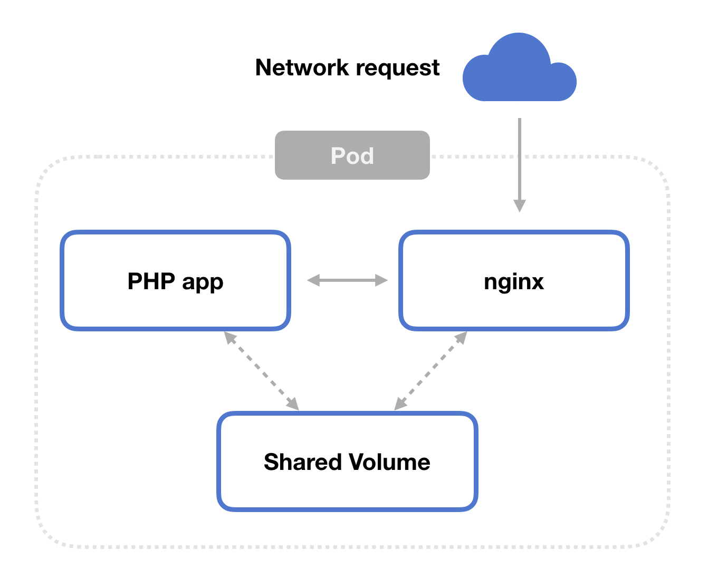

# fpm-nginx

Let's PHP-FPM and Nginx working together in a container

# Why these 2 services in 1 image?

Putting 2 services in a same image is a Docker anti-pattern!

However, in certain situations, there is no other choice :-(

As explained in this document: https://matthewpalmer.net/kubernetes-app-developer/articles/php-fpm-nginx-kubernetes.html, 

when we need to run nginx and php-fpm in a kubernetes pod, we can use a shared volume, mounted on fpm pod and copied at nginx startup phase like in this diagram:

This solution can't work on some situations:

- When the application to deploy contains a lot of files or big files: the copy phase can be very long (a couple of minutes before pod is ready)

- When we want to use https://devspace.sh/ for code development/debug (the container is restarted and code updated everytime the developer is changing his code).

